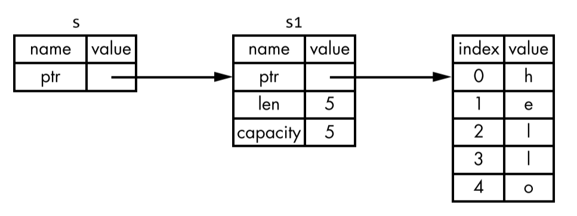

러스트 공부를 위한 기록용 리포지토리입니다.

# 리소스 참고 웹페이지
- https://edu.anarcho-copy.org/Programming%20Languages/Rust/rust-programming-language-steve-klabnik.pdf<br>
    러스트를 배우고자 하는 사람들은 한 번씩은 찾는다는 그 `The Rust Programming Language` 책의 PDF.
- https://javascriptweekly.com/link/120318/7b14d2bdbf<br>
    JS 개발자들을 위한 러스트 학습용 PDF. 166페이지로 짧은 시간 내에 부담 없이 배우기 좋을 듯 싶다.
- https://parksb.github.io/article/35.html<br>
    러스트에 대한 내용을 장점 위주로 한국어로 요약한 페이지.

# 러스트 설치하기
brew나 apt에서도 러스트를 설치할 수 있으나, 최신 버전 업데이트가 많이 느리고 러스트 공식 책에서도 권장하고 있지 않다.
리눅스와 맥에서는 아래와 같이 설치하도록 하자.

```bash
curl https://sh.rustup.rs -sSf | sh
```

윈도우에서는 <https://www.rust-lang.org/tools/install/> 링크로 들어가 다운로드 받도록 하자.
그런데 윈도우 환경에서는 컴파일하기 위해 Visual C++ Build Tools 툴체인을 추가적으로 요구하고 있다.
이런 점에서 러스트가 Golang보다는 상대적으로 약점을 보여주고 있다.

# 러스트와 같이 오는 프로그램들
러스트를 깔면 아래와 같은 프로그램도 깔리게 된다.

- rustup<br>
    러스트를 위한 툴체인 인스톨러다. nvm과 비슷하다.
- cargo<br>
    러스트의 빌드 시스템과 패키지 매니저 역할을 수행한다. npm과 비슷하다.
- rustc<br>
    러스트 컴파일러다. gcc와 비슷한데 cargo가 프로젝트 빌딩 역할을 수행하므로
    간단한 파일 하나 빌딩과 같이 경우 외엔 잘 쓰이질 않을 것이다.

# Expression과 Statement
Statement: 명령을 수행하며 자체적인 값을 가지지 않음.<br>
Expression: 자체적인 값을 가짐.

러스트에서는 Assignment Operation는 C계열 언어와 달리 Expression이 아니며,
Expression에 `;`을 붙이면 Statement가 된다.
러스트에서는 Curly Bracket 내부 맨 끝 줄에 Expression을 포함하면
해당 구문은 마지막 Expression을 반환하게 되며 (이는 다시 말해 블럭 구문이 Expression이 될 수 있다는 뜻이다),
if문도 Expression이 될 수 있다. 따라서 아래와 같은 소스 코드에서:

```rust
fn func() {
    let a = {
        let tmp = 0;
        tmp+1
    };
    let b = if 1 == a {
        true
    } else {
        false
    };
    let c = {
        let x = 1;
        x+4
    };
    println!("{} {} {}", a, b, c);
}
```

`a`는 `1`이 되며, `b`는 `true`, `c`는 `5`가 된다.<br>

# Macro
매크로란 컴파일 타임에 다른 코드로 바뀌는 인라인 코드이다.
러스트에서 매크로 함수는 뒤에 `!`가 붙는다.

# 변수
러스트에서 변수들의 변형을 막음으로써 러스트의 안전성과 병행성을 보장하기 위해
변수들은 기본적으로 **immutable**하다.

## let과 const
러스트에서 변수는 `let`과 `const` 이 두 가지로 구별되는데
두 가지 모두 기본적으로 immutable하다.

const가 let과 구별되는 특징은 다음과 같다.
- `const`는 무조건 immutable하다.<br>
    `let mut`과 같이 변수를 선언하면 변할 수 있는 변수를 만들 수 있다.
    그러나 const는 불가능하다.<br>
- `const`는 타입을 명시해야 한다.<br>
    let은 타입 추정으로 명시하지 않아도 되고 오히려 명시를 해주면
    경고를 띄우지만 const는 타입 명시가 필수적이다.
- `const`는 어느 스코프에도 선언이 가능하다.<br>
    const는 전역 범위에도 선언이 가능하지만 let은 불가능하다.
- `const`는 대문자로 선언해야 한다.<br>
    여느 다른 언어와 마찬가지로 const는 대문자로 선언해줘야 하며,
    소문자로 선언 시 경고를 내뱉는다.

## Shadowing
`let`은 기본적으로 immutable하지만 `mut` 키워드 없이 mutable한
변수를 만들 수 있다. 바로 똑같은 이름으로 재선언을 하는 것이다.

```rust
fn main() {
    let a=3;
    let a=a.to_string();
    println!("{}", a);
}
```

이를 Shadowing이라고 하는데, mut 키워드를 선언할 때와 달리
여전히 immutable한 특성을 유지하며, 변수의 타입 변경이 가능하다.

## 변수 타입
러스트는 Statically Typed Language이기에 당연히 데이터의 타입이 존재한다.
컴파일 타임에 모든 변수는 명시적으로든 암시적으로든 타입을 추정할 수 있어야 하며
그렇지 못할 시 에러가 발생한다.

여기부터 아래는 Scalar 타입이다.

### Integer
Integer는 소수점이 없는 숫자를 말한다. 러스트의 integer 타입은 간편하게도
unsigned signed에 따라 `u`와 `i`, 그리고 차지하는 비트 크기에 따라
뒤에 비트 크기가 붙는다. 러스트는 명시되지 않은 정수에 대해서
기본적으로 64bit 환경에서도 가장 빠른 i32를 사용한다.

추가로 `isize`와 `usize`라는 정수 타입은 실행 환경의 arch (32/64bit)에 따라
달라진다.

러스트에서 integer literal은 아래와 같은 포맷을 지원한다.

|리터럴|예시|
|---|---|
|10진수|`12_345_678`|
|16진수|`0xff`|
|8진수|`0o77`|
|2진수|`0b1234-5678`|
|바이트(`u8`만 지원)|`b'A'`|


### Floating Point
러스트에서 소수 타입은 `f32`, 그리고 `f64`가 존재한다.
기본적으로 러스트는 `f64` 타입을 사용한다.

### Boolean
러스트는 1바이트 크기의 `true` 그리고 `false`의 불린을 지원한다.

### Char
러스트에서는 곁따옴표의 String과 달리 Char는 홑따옴표를 사용하며
**Unicode를 지원하기 위해 4바이트의 크기를 가진다**.
따라서 한국어와 함께 이모지도 러스트의 Char 변수에 넣을 수 있다.

***

이 다음은 Compound 타입이다.

러스트는 두 개의 원시 compound 타입을 가지고 있다: `tuple`과 `array`이다.

### Tuple
튜플은 여러 가지의 타입의 변수들을 하나의 변수로 묶을 수 있다.
튜플은 **고정된 길이**를 가지며 아래와 같이 선언하되,
타입 명시는 자유롭게 해도 좋고 안 해도 좋다.
또한 러스트의 튜플은 `destructuring`이 가능하다.
또는 인덱스로 접근하기 위해서는 `period`를 쓰면 된다.

```rust
let tup: (i32, f64, u8) = (500, 6.4, 1);
let (x, y, z) = tup;
let five_hundred = tup.0;
```

위 프로그램에서 `x`는 `500`의 `i32` 타입의 변수가 되며
`five_hundred`도 마찬가지의 변수가 된다.

### Array
어레이는 튜플과 똑같이 고정된 길이를 가지며
타입 명시는 선택이다.
튜플과 다른 점으로는 모든 엘리먼트의 타입이
같아야 한다는 것이 있다.
어레이는 아래와 같이 선언할 수 있다.

```rust
let array = [1, 2, 3];
```

어레이는 스택 영역에 저장되며 고정된 리스트가 필요할 때 (e.g. 12달의 영어 표기)
유용하다.

어레이의 타입을 명시해주고 싶다면 아래와 같이 선언할 수 있다.
첫번째 인덱스에는 타입이, 두번째에는 어레이의 길이가 들어가면 된다.

```rust
let array: [i32; 3] = [1, 2, 3];
```

또한 만약 같은 값을 가진 변수로 어레이를 채우고 싶다면 아래와 같이
첫번째 인덱스에는 고정값, 두번째에는 어레이의 길이를 넣어주면 된다.

```rust
// array는 [3, 3, 3, 3, 3]이 된다.
let array = [3; 5];
```

어레이의 엘리먼트에 접근하고 싶다면 여타 다른 언어와 같이 `array[3]`으로 접근할 수 있다.

# 함수
러스트의 함수는 `fn` 키워드로 선언이 시작되며, 파라미터는 항상 타입을 명시해야 하며,
리턴 타입은 함수 블록 시작 전 `->`로 명시할 수 있다.

> ❗ Parameter는 함수 선언의 변수를, Argument는 함수를 부를 때<br>
> 명시된 값을 의미하지만 보통 이 두 단어를 섞어 부른다.

# if 문
러스트에서 if 문은 바깥에 괄호를 넣지 않아도 된다.

만약 if 문을 Expression으로 쓰고 싶은 경우 각 if와 else if 문이 반환하는 값의 타입은
동일해야 함을 기억하자.

# 반복문
러스트에는 세 가지의 반복문 (iteration)이 존재한다: `loop`, `while`, `for`.

## loop
`loop`은 명시적인 브레이크 문을 만날 때까지 무한반복된다.

```rust
fn iter() {
    let mut i = 0;
    loop {
        println!("loop");
        i += 1;
        if i == 5 {
            break;
        }
    }
}
```

위에서 loop은 5번 실행되고 브레이크 문을 만나 종료한다.

재미있는건 loop도 Expression이 되어 값 반환을 할 수 있다.
`break` 키워드 다음 loop에서 반환하고자 하는 값을 붙여주면 된다.

```rust
fn iter() -> i32 {
    let mut cnt = 0;
    return loop {
        cnt += 1;
        if cnt == 5 {
            // return cnt here.
            break cnt;
        }
    };
}
```

위 함수의 loop에서 `cnt`가 5가 되면 cnt를 반환하고 있다.
함수 자체가 loop이 반환하는 값을 그대로 반환하고 있으므로
함수 반환값은 `cnt`가 된다.

## while
while 문은 여타 다른 언어와 같은 문법을 지니고 있다.

```rust
fn iter() -> i32 {
    let mut cnt = 0;
    while cnt < 3 {
        println!("{}", cnt);
        cnt += 1;
    };
}
```

## for
for 문은 다른 언어의 iterator와 비슷하다.

```rust
fn iter() {
    // using array itself like below did not work until 2021 edtion.
    // https://blog.rust-lang.org/2021/05/11/edition-2021.html#intoiterator-for-arrays
    for i in [1, 2, 4, 8] {
        println!("{}", i);
    }
    let arr = [1, 2, 3];
    for i in arr.iter() {
        println!("{}", i);
    }
}
```

참고로 `Range`라는 타입을 쓰면 아래와 같이 for 문을 이용할 수도 있다.

```rust
fn iter() {
    let arr = 1..3;
    for i in arr {
        println!("{}", i);
    }
}
```

# Ownership
`Ownership`이란 러스트를 다른 언어와 가장 구별되는 특징으로,
러스트의 안전한 메모리 관리를 가능케 하는 컴파일 타임에 적용되는 메모리 관리 기법이다.

러스트의 소유권의 **기본적인 세 가지 원칙**은 아래와 같다.
- 메모리를 가리키는 변수를 owner (소유자)라고 한다.
- 메모리는 동시에 최대 하나의 소유자만 존재한다.
- 소유자가 스코프에서 사라지면, 소유자가 가리키는 메모리는 drop 된다.<br>
  (C/C++에서 메모리를 unallocate 할 때 부르는 free를 러스트에서는 `drop`이라 표현한다.)

## Copy와 Move, 그리고 Clone
러스트에서 변수 하나를 다른 변수에 할당할 때,
스택에서만 존재하는 데이터는 `Copy`를 수행하고,
힙에서도 존재하는 데이터는 `Move`를 수행한다.

```rust
fn main() {
    let a = 5;
    let b = a;
    let x = String::from("Hello");
    let y = x;
    println!("{}", a);
    println!("{}", b);
    // println!("{}", x); error. x is moved.
    println!("{}", y);
}
```

Integer 타입은 스택에만 데이터가 존재하기에 Assign 수행 시
값을 Copy 하므로 소유권 이동이 일어나지 않는다.
러스트 입장에서는 Integer를 복사하는 것은 간단하므로 굳이
복사를 하지 않을 필요성이 없다.

하지만 `String` 타입은 힙에 문자열 데이터가 존재하고 스택에 해당 힙의 포인터,
문자열 길이, capacity 등의 데이터가 존재하기에 Move가 수행되므로 `let y = x;`
수행 시 `x`의 소유권은 이전되었으므로 `x`는 사용할 수 없다.

만약 String의 Assign에서 일어나는 기본적인 양식이 복사였으면
힙 메모리 상의 할당과 메모리 복사가 일어나게 되므로 Integer와 달리
Copy의 Cost가 크다. 따라서 러스트는 기본적의 String에 대해서는
Copy가 아닌 Move를 실행하도록 하였다.

또한 여기서 `메모리는 동시에 최대 하나의 소유자만 존재한다.`
라는 원칙이 지켜지는 것을 확인할 수 있다.

만일 `String` 타입의 변수를 힙 데이터까지 포함하여 `deep copy`하고 싶다면
`Clone`을 수행하면 된다.

```rust
fn main() {
    let a = 5;
    let b = a.clone();
    let x = String::from("Hello");
    let y = x.clone();
    println!("{}", a);
    println!("{}", b);
    println!("{}", x); // error. x is moved.
    println!("{}", y);
}
```

Integer 변수인 `a`는 스택에만 존재하며 사이즈가 컴파일 타임에 고정되어 있기에,
러스트 입장에서는 `a`를 invalidate 할 필요가 없다. 다시 말해 해당 변수의
`deep copy`와 `shallow copy`는 다를 이유가 하등 없으며,
`a.clone()`은 Copy와 다르지 않다.

Integer 타입과 같은 타입들은 `Copy trait`이 존재하며, 이러한 타입들은
할당 후에도 원래 변수들은 여전히 유효하다.

단, `Drop trait`이 정의돼 있거나 변수 내에 `Drop trait`이 정의된
멤버가 있다면 `Copy trait`을 정의할 수 없다.

`Copy` 타입 변수들은 아래와 같다.
- Integer
- Boolean
- character
- floating point
- Tuple. 단 멤버들이 모두 `Copy`여야 함.

## Ownership과 Function
함수의 argument로 변수를 넘겨주는 것은 Assignment과 동일하게
copy 또는 move를 수행한다.

또한, 함수에서 값을 반환하는 것도 동일하게 소유권을 이전하게 된다.

## Reference
만약 callee에게 넘겨준 변수의 소유권을 다시 되돌려 받고 싶다면
다시 해당 변수를 아래와 같이 반환 받으면 된다.

```rust
fn main() {
    let s = String::from("Hello");
    let (s, len) = calc_len(s);
    println!("length of {} is {}", s, len);
}

fn calc_len(str: String) -> (String, usize) {
    let len = str.len();
    return (str, len);
}
```

그러나 매번 이렇게 튜플로 다시 돌려받는 것은 너무 tedious (지루한, 싫증나는) 하다.
이러한 번잡스러운 행위 없이 변수는 넘겨주되 소유권은 넘겨주지 않는 것,
바로 `Reference`로서 넘겨주면 된다.

```rust
fn main() {
    let s1 = String::from("Hello");
    let len = calc_len(&s1);
    println!("length of {} is {}", s1, len);
}

fn calc_len(s: &String) -> usize {
    let len = s.len();
    return len;
}
```

`&` 기호를 타입 앞에 붙여줌으로써 오브젝트의 Reference만을 넘겨주게 된다.
소유권을 넘겨받지 않았기에 해당 Reference는 함수 스코프 끝을 만나도
Drop 되지 않는다. 이렇게 Reference로서 변수를 가져오는 것을
`Borrowing`이라고 한다.



`borrow` 한 변수들도 `let` 변수와 마찬가지로 기본적으로 immutable하다.
mutable한 Reference를 원한다면 `&mut` 키워드로 파라미터의 타입을
선언하면 된다.

> ❗ 단, mutable reference의 대상이 될 변수도 mutable 해야 한다.

하지면 mutable reference는 제한점이 존재하는데 그것은 아래와 같다.
- 스코프에서 특정 데이터에 대한 mutable reference는 하나만 가능하다.

따라서 아래와 같은 프로그램은 컴파일 에러가 발생한다.

```rust
fn main() {
    let mut s = String::from("hello");
    let s1= &mut s;
    let s2= &mut s;
    println!("{} {}", s1, s2);
}
```

`s2`가 instantiate 되면 `s1`은 자동으로 invalid 된다.

이러한 제약은 컴파일 타임에 `Race Condition`을 예방할 수 있도록 해준다.

또한 **mutable Reference와 immutable reference는 공존할 수 없다.**
immutable reference로는 값을 변경할 수 없기에
immutable reference는 얼마든지 생성할 수 있다.

## Dangling Reference
이미 free 된 메모리를 가리키는 포인터를 Dangling pointer라고 하며,
러스트에서는 언어적으로 이러한 Dangling Reference를 방지하고 있다.

```rust
fn main() {
    let reference_to_nothing = dangle();
}
fn dangle() -> &String {
    let s = String::from("hello");
    &s
}
```

위 코드에서 `dangle` 함수는 스코프 밖에서 drop 되었을 변수의
reference를 반환하기에 컴파일 타임에 에러를 발생한다.
reference를 반환하기 보다는 변수 그 자체를 반환하도록 함으로써
에러를 피해갈 수 있다.

> ❗ lifetime을 지정함으로써 이 에러를 회피할 수 있다.

## slice
slice는 소유권을 포함하지 않은 또다른 데이터 타입이다.
타입 자체는 immutable Reference와 같으며,
slice는 전체보다는 특정 연속 부분만을 참조하게 하고 싶을 때
쓰인다. 또한 slice는 해당 변수의 상태에 따라 유효성이 달라진다.

```rust
fn main() {
    let s = String::from("Hello World");
    let hello = &s[0..5];
    let world = &s[6..11];
    println!("{}", s);
    println!("{}", hello);
    println!("{}", world);
}
```

참고로 slice에서 변수의 처음부터 참조한다면 시작 인덱스,
또는 변수의 끝까지 참조한다면 마지막 인덱스는 생략 가능하다.
따라서 `&s[..]`는 변수 전체를 가리키게 된다.

slice가 immutable reference 타입이기에
만약 변수의 데이터를 바꾸고자 한다면 컴파일 에러를 발생시킴으로써
프로그램의 올바른 작동을 보장하게 된다.

> ❗ string literal도 slice이므로 literal도 변경 불가능하다.

> ❗ slice는 String뿐만 아니라 array 타입에도 아래와 같이 적용할 수 있다.

```rust
fn main() {
    let a = [1, 2, 3];
    let a1 = &a[..2];
    for ele in a1 {
        println!("{}", ele);
    }
}
```
